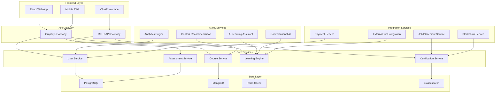

# Design Document: Industry Training Platform

## Overview

The Industry Training Platform is a comprehensive, AI-powered learning ecosystem that bridges the gap between academic education and industry requirements. The platform combines traditional e-learning with cutting-edge technologies including AI personalization, VR/AR experiences, blockchain credentials, and real-time industry integration.

The architecture follows a microservices approach with a modern React-based frontend, Node.js backend services, and cloud-native infrastructure supporting scalability and real-time features.

## Architecture

### High-Level Architecture



### Technology Stack

**Frontend:**
- React 18 with TypeScript for web application
- React Native for mobile PWA
- Three.js/A-Frame for VR/AR experiences
- Framer Motion for animations and card scroll effects
- Tailwind CSS for styling

**Backend:**
- Node.js with Express.js for API services
- GraphQL with Apollo Server for flexible data queries
- Socket.io for real-time features
- Bull Queue for background job processing

**AI/ML:**
- TensorFlow.js for client-side AI features
- Python with scikit-learn for recommendation engine
- OpenAI GPT integration for conversational AI
- Custom neural networks for learning path optimization

**Infrastructure:**
- AWS/Azure cloud services
- Docker containers with Kubernetes orchestration
- CDN for global content delivery
- WebRTC for live video sessions

## Components and Interfaces

### Core Components

#### 1. User Management System

**UserService Interface:**
```typescript
interface UserService {
  createUser(userData: UserRegistration): Promise<User>
  authenticateUser(credentials: LoginCredentials): Promise<AuthToken>
  updateProfile(userId: string, profile: UserProfile): Promise<User>
  getLearningHistory(userId: string): Promise<LearningHistory>
  getSkillProfile(userId: string): Promise<SkillProfile>
}

interface User {
  id: string
  email: string
  profile: UserProfile
  learningPreferences: LearningPreferences
  skillProfile: SkillProfile
  subscriptionStatus: SubscriptionStatus
  createdAt: Date
  lastActive: Date
}
```

#### 2. Course Management System

**CourseService Interface:**
```typescript
interface CourseService {
  createCourse(courseData: CourseCreation): Promise<Course>
  getCourse(courseId: string): Promise<Course>
  searchCourses(criteria: SearchCriteria): Promise<Course[]>
  enrollUser(userId: string, courseId: string): Promise<Enrollment>
  getRecommendations(userId: string): Promise<Course[]>
}

interface Course {
  id: string
  title: string
  description: string
  instructor: Instructor
  modules: Module[]
  skillsTargeted: Skill[]
  difficulty: DifficultyLevel
  estimatedDuration: number
  certificationOffered: boolean
  industryRelevance: IndustryTag[]
}
```

#### 3. AI Learning Assistant

**AILearningAssistant Interface:**
```typescript
interface AILearningAssistant {
  assessLearningStyle(userId: string, responses: AssessmentResponse[]): Promise<LearningStyle>
  generatePersonalizedPath(userId: string, goals: LearningGoal[]): Promise<LearningPath>
  adaptContentDifficulty(userId: string, performance: PerformanceData): Promise<ContentAdaptation>
  provideTutoring(userId: string, question: string, context: LearningContext): Promise<TutoringResponse>
  predictOptimalSchedule(userId: string, constraints: TimeConstraints): Promise<StudySchedule>
}

interface LearningStyle {
  visualPreference: number
  auditoryPreference: number
  kinestheticPreference: number
  readingPreference: number
  pacePreference: PaceType
  complexityTolerance: number
}
```

#### 4. Assessment and Certification Engine

**AssessmentService Interface:**
```typescript
interface AssessmentService {
  createAssessment(assessmentData: AssessmentCreation): Promise<Assessment>
  submitAssessment(userId: string, assessmentId: string, answers: Answer[]): Promise<AssessmentResult>
  generateCertificate(userId: string, courseId: string): Promise<Certificate>
  validateSkillLevel(userId: string, skillId: string): Promise<SkillValidation>
  trackProgress(userId: string, courseId: string): Promise<ProgressReport>
}

interface Assessment {
  id: string
  courseId: string
  type: AssessmentType
  questions: Question[]
  passingScore: number
  timeLimit: number
  allowedAttempts: number
}
```

#### 5. VR/AR Learning Environment

**VRLearningService Interface:**
```typescript
interface VRLearningService {
  createVRSession(userId: string, scenarioId: string): Promise<VRSession>
  loadScenario(scenarioId: string): Promise<VRScenario>
  trackVRInteractions(sessionId: string, interactions: VRInteraction[]): Promise<void>
  generateVRFeedback(sessionId: string): Promise<VRFeedback>
  supportedDevices(): Promise<VRDevice[]>
}

interface VRScenario {
  id: string
  name: string
  description: string
  skillsTargeted: Skill[]
  environment: VREnvironment
  interactions: VRInteractionType[]
  assessmentCriteria: AssessmentCriteria[]
}
```

#### 6. Blockchain Credential System

**BlockchainService Interface:**
```typescript
interface BlockchainService {
  issueCertificate(certificateData: CertificateData): Promise<BlockchainCertificate>
  verifyCertificate(certificateHash: string): Promise<VerificationResult>
  createNFTAchievement(achievementData: AchievementData): Promise<NFTAchievement>
  transferNFT(fromUserId: string, toUserId: string, nftId: string): Promise<TransferResult>
  getWalletCredentials(userId: string): Promise<WalletCredentials>
}

interface BlockchainCertificate {
  hash: string
  issuer: string
  recipient: string
  courseId: string
  skillsVerified: Skill[]
  issueDate: Date
  expirationDate?: Date
  verificationUrl: string
}
```

### Integration Components

#### 1. External Tool Integration

**ExternalToolService Interface:**
```typescript
interface ExternalToolService {
  authenticateWithTool(userId: string, toolId: string, credentials: ToolCredentials): Promise<ToolSession>
  executeToolAction(sessionId: string, action: ToolAction): Promise<ToolResult>
  syncToolData(userId: string, toolId: string): Promise<SyncResult>
  getSupportedTools(): Promise<ExternalTool[]>
}

interface ExternalTool {
  id: string
  name: string
  category: ToolCategory
  authType: AuthenticationType
  capabilities: ToolCapability[]
  integrationEndpoints: APIEndpoint[]
}
```

#### 2. Job Placement System

**JobPlacementService Interface:**
```typescript
interface JobPlacementService {
  matchUserToJobs(userId: string): Promise<JobMatch[]>
  createJobAlert(userId: string, criteria: JobCriteria): Promise<JobAlert>
  submitApplication(userId: string, jobId: string, application: JobApplication): Promise<ApplicationResult>
  getCareerAdvice(userId: string, careerGoals: CareerGoal[]): Promise<CareerAdvice>
  scheduleInterviewPrep(userId: string, interviewType: InterviewType): Promise<InterviewSession>
}

interface JobMatch {
  jobId: string
  title: string
  company: string
  matchScore: number
  requiredSkills: Skill[]
  userSkillGaps: SkillGap[]
  salaryRange: SalaryRange
  location: Location
}
```

## Data Models

### Core Entities

#### User and Profile Models

```typescript
interface User {
  id: string
  email: string
  passwordHash: string
  profile: UserProfile
  preferences: UserPreferences
  subscription: Subscription
  createdAt: Date
  updatedAt: Date
}

interface UserProfile {
  firstName: string
  lastName: string
  avatar?: string
  bio?: string
  currentRole?: string
  experienceLevel: ExperienceLevel
  careerGoals: CareerGoal[]
  location: Location
  linkedinProfile?: string
  portfolioUrl?: string
}

interface UserPreferences {
  learningStyle: LearningStyle
  notificationSettings: NotificationSettings
  privacySettings: PrivacySettings
  accessibilityNeeds: AccessibilitySettings
}
```

#### Course and Content Models

```typescript
interface Course {
  id: string
  title: string
  slug: string
  description: string
  longDescription: string
  instructor: Instructor
  coInstructors: Instructor[]
  modules: Module[]
  prerequisites: Prerequisite[]
  learningObjectives: LearningObjective[]
  skillsTargeted: Skill[]
  industryTags: IndustryTag[]
  difficulty: DifficultyLevel
  estimatedHours: number
  language: string
  subtitles: string[]
  pricing: CoursePricing
  ratings: CourseRating
  enrollmentCount: number
  completionRate: number
  lastUpdated: Date
  status: CourseStatus
}

interface Module {
  id: string
  courseId: string
  title: string
  description: string
  orderIndex: number
  lessons: Lesson[]
  assignments: Assignment[]
  estimatedDuration: number
  prerequisites: string[]
}

interface Lesson {
  id: string
  moduleId: string
  title: string
  type: LessonType
  content: LessonContent
  duration: number
  orderIndex: number
  isOptional: boolean
  completionCriteria: CompletionCriteria
}
```

#### Learning and Progress Models

```typescript
interface LearningPath {
  id: string
  userId: string
  title: string
  description: string
  courses: CourseSequence[]
  estimatedDuration: number
  skillsToAcquire: Skill[]
  careerOutcome: CareerOutcome
  progress: PathProgress
  createdAt: Date
  updatedAt: Date
}

interface Enrollment {
  id: string
  userId: string
  courseId: string
  enrollmentDate: Date
  startDate?: Date
  completionDate?: Date
  progress: CourseProgress
  currentModule: string
  currentLesson: string
  timeSpent: number
  lastAccessed: Date
  status: EnrollmentStatus
}

interface SkillProfile {
  userId: string
  skills: UserSkill[]
  certifications: Certification[]
  endorsements: SkillEndorsement[]
  lastUpdated: Date
}

interface UserSkill {
  skillId: string
  level: SkillLevel
  confidence: number
  lastPracticed: Date
  hoursSpent: number
  sourceType: SkillSourceType
  verificationStatus: VerificationStatus
}
```

#### Assessment and Certification Models

```typescript
interface Assessment {
  id: string
  courseId: string
  moduleId?: string
  title: string
  description: string
  type: AssessmentType
  questions: Question[]
  passingScore: number
  maxAttempts: number
  timeLimit: number
  isProctored: boolean
  availableFrom: Date
  availableUntil?: Date
}

interface Certificate {
  id: string
  userId: string
  courseId: string
  templateId: string
  issueDate: Date
  expirationDate?: Date
  credentialId: string
  blockchainHash?: string
  verificationUrl: string
  skills: CertifiedSkill[]
  issuer: CertificateIssuer
  status: CertificateStatus
}

interface NFTAchievement {
  id: string
  userId: string
  tokenId: string
  contractAddress: string
  achievementType: AchievementType
  title: string
  description: string
  rarity: RarityLevel
  metadata: NFTMetadata
  mintDate: Date
  currentOwner: string
  transferHistory: NFTTransfer[]
}
```

#### VR/AR and Immersive Learning Models

```typescript
interface VRSession {
  id: string
  userId: string
  scenarioId: string
  startTime: Date
  endTime?: Date
  interactions: VRInteraction[]
  performance: VRPerformance
  feedback: VRFeedback[]
  deviceUsed: VRDevice
  status: SessionStatus
}

interface VRScenario {
  id: string
  title: string
  description: string
  skillsTargeted: Skill[]
  environment: VREnvironment
  objects: VRObject[]
  npcs: VRCharacter[]
  objectives: VRObjective[]
  assessmentCriteria: VRAssessmentCriteria[]
  supportedDevices: VRDevice[]
}

interface VRInteraction {
  timestamp: Date
  type: InteractionType
  objectId: string
  action: string
  result: InteractionResult
  score?: number
  feedback?: string
}
```

#### Job Placement and Career Models

```typescript
interface Job {
  id: string
  title: string
  company: Company
  description: string
  requirements: JobRequirement[]
  skillsRequired: Skill[]
  experienceLevel: ExperienceLevel
  salaryRange: SalaryRange
  location: Location
  remoteOptions: RemoteOption[]
  benefits: Benefit[]
  applicationDeadline?: Date
  postedDate: Date
  status: JobStatus
}

interface MicroInternship {
  id: string
  companyId: string
  title: string
  description: string
  duration: number
  compensation: number
  skillsRequired: Skill[]
  deliverables: Deliverable[]
  mentorId?: string
  maxParticipants: number
  currentParticipants: number
  startDate: Date
  endDate: Date
  applicationDeadline: Date
}

interface CareerPath {
  id: string
  title: string
  description: string
  roles: CareerRole[]
  skillProgression: SkillProgression[]
  salaryProgression: SalaryProgression[]
  timeToAdvancement: number[]
  industryDemand: DemandLevel
}
```

Now I need to use the prework tool to analyze the acceptance criteria before writing the Correctness Properties section.

## Correctness Properties

*A property is a characteristic or behavior that should hold true across all valid executions of a system—essentially, a formal statement about what the system should do. Properties serve as the bridge between human-readable specifications and machine-verifiable correctness guarantees.*

### Property 1: Course Search Relevance and Ranking
*For any* search query and course database, all returned courses should be relevant to the search terms and ranked by industry demand score in descending order
**Validates: Requirements 1.2**

### Property 2: Course Display Completeness
*For any* course displayed in the catalog, the rendered output should contain title, duration, difficulty level, instructor name, and value proposition text
**Validates: Requirements 1.3**

### Property 3: Personalized Recommendations for Experienced Users
*For any* user with completed courses, the recommendation system should return personalized learning paths, while users with no course history should receive general popular courses
**Validates: Requirements 1.4**

### Property 4: Course Detail Structure Consistency
*For any* course detail page, the content should include clearly labeled "What?", "Why?", "How?", and "What's there for me?" sections with non-empty content
**Validates: Requirements 1.5**

### Property 5: Interactive Video Content Integration
*For any* course content with video lessons, the video player should include interactive elements and be properly integrated with YouTube API
**Validates: Requirements 2.1**

### Property 6: Real-time Progress Tracking
*For any* learner activity within a course, the progress tracking system should update completion percentages and provide immediate feedback within 2 seconds
**Validates: Requirements 2.3**

### Property 7: Learning History Persistence
*For any* learning activity (course enrollment, module completion, assessment submission), the activity should be permanently recorded and retrievable in the user's learning history
**Validates: Requirements 3.3**

### Property 8: Milestone Badge Award System
*For any* learner reaching a defined milestone, the system should automatically award the appropriate badge and update the user's skill profile within the same transaction
**Validates: Requirements 3.4**

### Property 9: Certificate Generation Completeness
*For any* learner completing all course requirements, the generated certificate should include course details, completion date, skills achieved, and a unique verification identifier
**Validates: Requirements 4.1, 4.3**

### Property 10: Certificate Verification Round-trip
*For any* issued certificate, submitting the certificate's verification identifier to the public verification system should return the complete, unmodified certificate data
**Validates: Requirements 4.2**

### Property 11: Job Matching Relevance
*For any* certified learner, all job matches returned by the placement system should require skills that overlap with the learner's certified competencies by at least 70%
**Validates: Requirements 5.1**

### Property 12: Resume Generation Completeness
*For any* user with certifications and skills, the generated resume should include all verified certifications, skill assessments, and completed courses
**Validates: Requirements 5.2**

### Property 13: AI Learning Style Assessment Consistency
*For any* new learner completing the onboarding assessment, the AI system should generate a learning style profile with all four learning preference scores (visual, auditory, kinesthetic, reading) totaling 100%
**Validates: Requirements 12.1**

### Property 14: Adaptive Content Difficulty Adjustment
*For any* learner with performance data below 70% accuracy, the platform should automatically reduce content difficulty level and provide additional support resources
**Validates: Requirements 12.2**

### Property 15: Blockchain Certificate Immutability
*For any* certificate issued to the blockchain, the certificate data should be cryptographically verifiable and immutable, with any verification attempt returning identical results
**Validates: Requirements 15.1, 15.4**

### Property 16: NFT Achievement Uniqueness
*For any* exceptional achievement qualifying for NFT creation, the generated NFT should have a unique token ID and be properly minted to the learner's wallet address
**Validates: Requirements 15.2**

### Property 17: Cross-platform Credential Portability
*For any* blockchain credential, the export functionality should generate a standardized format that can be verified on external platforms without platform-specific dependencies
**Validates: Requirements 15.3**

### Property 18: NFT Marketplace Transaction Integrity
*For any* NFT trade in the marketplace, the transaction should atomically transfer ownership, update marketplace listings, and record the transaction history
**Validates: Requirements 15.5**

## Error Handling

### Input Validation and Sanitization

**User Input Validation:**
- All user inputs must be validated against defined schemas before processing
- File uploads must be scanned for malware and restricted to approved file types
- SQL injection and XSS protection through parameterized queries and input sanitization
- Rate limiting on API endpoints to prevent abuse

**Data Integrity Checks:**
- Database transactions must use ACID properties for critical operations
- Referential integrity constraints enforced at database level
- Data validation rules applied consistently across all service layers
- Backup and recovery procedures for data corruption scenarios

### Service Failure Handling

**Microservice Resilience:**
- Circuit breaker pattern implementation for external service calls
- Graceful degradation when non-critical services are unavailable
- Retry mechanisms with exponential backoff for transient failures
- Health checks and automatic service recovery procedures

**AI/ML Service Failures:**
- Fallback to rule-based systems when AI services are unavailable
- Cached recommendations when recommendation engine fails
- Manual override capabilities for critical AI-driven decisions
- Performance monitoring and automatic model rollback on accuracy degradation

### External Integration Error Handling

**Third-party Service Integration:**
- Timeout handling for external API calls (YouTube, LinkedIn, payment processors)
- Alternative content delivery when CDN services fail
- Blockchain network congestion handling with transaction queuing
- VR/AR device compatibility checks and graceful fallbacks

**Payment and Financial Transactions:**
- Idempotent payment processing to prevent duplicate charges
- Automatic refund processing for failed course deliveries
- Fraud detection and prevention mechanisms
- Compliance with financial regulations and audit trails

### User Experience Error Recovery

**Progressive Enhancement:**
- Core functionality available even when advanced features fail
- Offline mode for downloaded course content
- Automatic session recovery after network interruptions
- Clear error messages with actionable recovery steps

**Accessibility and Compatibility:**
- Browser compatibility fallbacks for unsupported features
- Screen reader compatibility for accessibility features
- Mobile device performance optimization and error handling
- Bandwidth-adaptive content delivery for poor network conditions

## Testing Strategy

### Dual Testing Approach

The platform requires both unit testing and property-based testing to ensure comprehensive coverage:

**Unit Tests** focus on:
- Specific examples and edge cases
- Integration points between microservices
- Error conditions and boundary cases
- User interface component behavior
- Database transaction integrity

**Property Tests** focus on:
- Universal properties that hold across all inputs
- Comprehensive input coverage through randomization
- System invariants and business rule validation
- Performance characteristics under load
- Security properties across different attack vectors

### Property-Based Testing Configuration

**Testing Framework Selection:**
- **Frontend**: fast-check for TypeScript/JavaScript property testing
- **Backend**: JSVerify for Node.js services
- **AI/ML Components**: Hypothesis for Python-based ML services
- **Database**: QuickCheck-style testing for data integrity properties

**Test Configuration Requirements:**
- Minimum 100 iterations per property test due to randomization
- Each property test must reference its corresponding design document property
- Tag format: **Feature: industry-training-platform, Property {number}: {property_text}**
- Seed-based randomization for reproducible test failures
- Performance benchmarks integrated with property tests

### Testing Categories

**Functional Testing:**
- User registration and authentication flows
- Course enrollment and progress tracking
- Assessment submission and grading
- Certificate generation and verification
- Payment processing and subscription management

**Integration Testing:**
- Microservice communication and data consistency
- External API integration (YouTube, LinkedIn, blockchain)
- Real-time features (chat, live sessions, notifications)
- Cross-platform compatibility (web, mobile, VR)
- Database migration and data synchronization

**Performance Testing:**
- Load testing for concurrent user scenarios
- Stress testing for peak enrollment periods
- Scalability testing for growing user base
- Response time validation for interactive features
- Resource utilization monitoring under various loads

**Security Testing:**
- Authentication and authorization mechanisms
- Data encryption and privacy protection
- Input validation and injection attack prevention
- Blockchain transaction security and wallet protection
- GDPR compliance and data handling procedures

**Accessibility Testing:**
- Screen reader compatibility across all interfaces
- Keyboard navigation for all interactive elements
- Color contrast and visual accessibility standards
- Mobile device accessibility features
- Multi-language and internationalization support

### Continuous Testing Pipeline

**Automated Testing Integration:**
- Pre-commit hooks for unit test execution
- Continuous integration pipeline with full test suite
- Automated property test execution on code changes
- Performance regression detection in CI/CD
- Security vulnerability scanning in deployment pipeline

**Monitoring and Alerting:**
- Real-time error tracking and alerting systems
- User experience monitoring and analytics
- Performance metrics and SLA monitoring
- Business metrics tracking (enrollment, completion rates)
- Automated incident response and escalation procedures

### Test Data Management

**Data Generation Strategies:**
- Synthetic user data generation for testing scenarios
- Course content templates for consistent testing
- Realistic assessment data for grading algorithm validation
- Blockchain test networks for credential testing
- VR/AR simulation environments for immersive feature testing

**Privacy and Compliance:**
- Anonymized production data for realistic testing
- GDPR-compliant test data handling procedures
- Secure test environment isolation from production
- Regular test data cleanup and retention policies
- Audit trails for test data access and usage