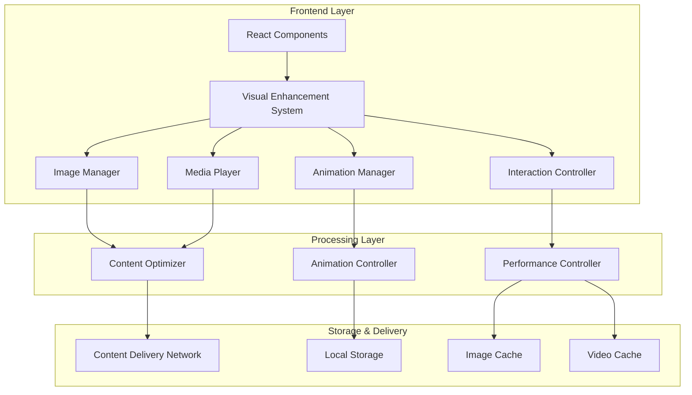

# Design Document: Visual Enhancement System

## Overview

The Visual Enhancement System will transform the existing industry training platform by implementing a comprehensive suite of visual features built on modern web technologies. The system extends the current React/TypeScript frontend with Framer Motion by adding advanced image management, sophisticated animations, interactive media players, and performance-optimized content delivery.

The design leverages proven technologies including the Intersection Observer API for scroll-triggered animations, modern image formats (WebP/AVIF), and a hybrid animation approach combining Framer Motion for UI animations with GSAP for complex data visualizations. The system maintains backward compatibility while providing a foundation for future visual enhancements.

## Architecture

### High-Level Architecture



### Component Architecture

The system follows a modular architecture with clear separation of concerns:

- **Visual Enhancement System Core**: Central orchestrator managing all visual components
- **Animation Manager**: Handles all animation logic using Framer Motion and GSAP
- **Image Manager**: Manages image loading, optimization, and responsive delivery
- **Media Player**: Custom video player with interactive features
- **Interaction Controller**: Manages user interactions with visual elements
- **Content Optimizer**: Handles image/video processing and optimization
- **Performance Controller**: Monitors and optimizes visual performance

## Components and Interfaces

### Core Visual Enhancement System

```typescript
interface VisualEnhancementSystem {
  animationManager: AnimationManager;
  imageManager: ImageManager;
  mediaPlayer: MediaPlayer;
  interactionController: InteractionController;
  performanceController: PerformanceController;
}

interface VisualConfig {
  enableAnimations: boolean;
  respectReducedMotion: boolean;
  imageQuality: 'low' | 'medium' | 'high' | 'auto';
  enableLazyLoading: boolean;
  enableParallax: boolean;
  animationDuration: number;
}
```

### Animation Manager

```typescript
interface AnimationManager {
  // Scroll-triggered animations
  registerScrollAnimation(element: HTMLElement, config: ScrollAnimationConfig): void;
  unregisterScrollAnimation(element: HTMLElement): void;
  
  // Page transitions
  executePageTransition(from: string, to: string): Promise<void>;
  
  // Micro-interactions
  registerHoverEffect(element: HTMLElement, config: HoverConfig): void;
  
  // Data visualizations
  animateCounter(element: HTMLElement, from: number, to: number, duration: number): void;
  animateProgressBar(element: HTMLElement, progress: number): void;
}

interface ScrollAnimationConfig {
  trigger: 'enter' | 'exit' | 'both';
  threshold: number;
  animation: FramerMotionVariants | GSAPTimeline;
  once?: boolean;
}

interface HoverConfig {
  scale?: number;
  rotate?: number;
  brightness?: number;
  duration?: number;
}
```

### Image Manager

```typescript
interface ImageManager {
  // Image loading and optimization
  loadImage(src: string, options: ImageLoadOptions): Promise<HTMLImageElement>;
  preloadImages(sources: string[]): Promise<void>;
  
  // Responsive image delivery
  getResponsiveImageSrc(baseSrc: string, width: number, quality?: string): string;
  generateSrcSet(baseSrc: string): string;
  
  // Gallery management
  createGallery(images: GalleryImage[], config: GalleryConfig): GalleryComponent;
  createBeforeAfterComparison(before: string, after: string): ComparisonComponent;
}

interface ImageLoadOptions {
  lazy?: boolean;
  placeholder?: string;
  quality?: 'low' | 'medium' | 'high' | 'auto';
  format?: 'webp' | 'avif' | 'jpeg' | 'png' | 'auto';
  sizes?: string;
}

interface GalleryImage {
  src: string;
  alt: string;
  caption?: string;
  thumbnail?: string;
}

interface GalleryConfig {
  layout: 'grid' | 'masonry' | 'carousel';
  itemsPerRow?: number;
  enableZoom?: boolean;
  enableFullscreen?: boolean;
  autoplay?: boolean;
}
```

### Media Player

```typescript
interface MediaPlayer {
  // Video player creation
  createPlayer(container: HTMLElement, config: PlayerConfig): VideoPlayerInstance;
  
  // Background video
  createBackgroundVideo(src: string, container: HTMLElement): BackgroundVideoInstance;
  
  // Interactive features
  addOverlay(player: VideoPlayerInstance, overlay: VideoOverlay): void;
  addChapterMarkers(player: VideoPlayerInstance, chapters: Chapter[]): void;
}

interface PlayerConfig {
  src: string | string[]; // Support for multiple sources/qualities
  poster?: string;
  autoplay?: boolean;
  muted?: boolean;
  controls?: boolean;
  customControls?: CustomControlsConfig;
  enableHLS?: boolean;
  enableDASH?: boolean;
}

interface VideoOverlay {
  type: 'text' | 'image' | 'interactive';
  content: string | HTMLElement;
  startTime: number;
  endTime: number;
  position: { x: number; y: number };
}

interface Chapter {
  title: string;
  startTime: number;
  thumbnail?: string;
}
```

### Interaction Controller

```typescript
interface InteractionController {
  // Drag and drop
  enableDragDrop(element: HTMLElement, config: DragDropConfig): void;
  
  // Touch gestures
  enableGestures(element: HTMLElement, config: GestureConfig): void;
  
  // Keyboard navigation
  enableKeyboardNavigation(element: HTMLElement, config: KeyboardConfig): void;
  
  // Accessibility
  ensureAccessibility(element: HTMLElement): void;
}

interface DragDropConfig {
  onDragStart?: (event: DragEvent) => void;
  onDragEnd?: (event: DragEvent) => void;
  onDrop?: (event: DragEvent) => void;
  dragImage?: HTMLElement;
  dropZones?: HTMLElement[];
}
```

### Performance Controller

```typescript
interface PerformanceController {
  // Performance monitoring
  measureCoreWebVitals(): CoreWebVitals;
  monitorAnimationPerformance(): AnimationMetrics;
  
  // Optimization
  optimizeForDevice(deviceInfo: DeviceInfo): OptimizationSettings;
  enableLowDataMode(): void;
  disableLowDataMode(): void;
  
  // Caching
  preloadCriticalAssets(assets: string[]): Promise<void>;
  clearCache(): void;
}

interface CoreWebVitals {
  LCP: number; // Largest Contentful Paint
  FID: number; // First Input Delay
  CLS: number; // Cumulative Layout Shift
}
```

## Data Models

### Visual Asset Models

```typescript
interface VisualAsset {
  id: string;
  type: 'image' | 'video' | 'animation';
  src: string;
  alt?: string;
  metadata: AssetMetadata;
  optimizations: AssetOptimizations;
}

interface AssetMetadata {
  width: number;
  height: number;
  fileSize: number;
  format: string;
  createdAt: Date;
  updatedAt: Date;
}

interface AssetOptimizations {
  webp?: string;
  avif?: string;
  thumbnails: { [size: string]: string };
  srcSet?: string;
}
```

### Animation Configuration Models

```typescript
interface AnimationSequence {
  id: string;
  name: string;
  steps: AnimationStep[];
  duration: number;
  easing: string;
  loop?: boolean;
}

interface AnimationStep {
  target: string; // CSS selector or element ID
  properties: { [key: string]: any };
  duration: number;
  delay?: number;
  easing?: string;
}
```

### Gallery and Media Models

```typescript
interface Gallery {
  id: string;
  title: string;
  description?: string;
  items: GalleryItem[];
  config: GalleryConfig;
  layout: GalleryLayout;
}

interface GalleryItem {
  id: string;
  asset: VisualAsset;
  caption?: string;
  order: number;
  metadata?: { [key: string]: any };
}

interface VideoContent {
  id: string;
  title: string;
  src: string | VideoSource[];
  poster?: string;
  duration: number;
  chapters?: Chapter[];
  overlays?: VideoOverlay[];
  captions?: CaptionTrack[];
}

interface VideoSource {
  src: string;
  type: string;
  quality: string;
  bitrate?: number;
}
```

## Correctness Properties

*A property is a characteristic or behavior that should hold true across all valid executions of a system—essentially, a formal statement about what the system should do. Properties serve as the bridge between human-readable specifications and machine-verifiable correctness guarantees.*

Before defining the correctness properties, I need to analyze the acceptance criteria from the requirements document to determine which ones are testable as properties.

### Property 1: Image Optimization and Delivery
*For any* image asset in the system, the Image_Manager should automatically optimize, resize, and deliver the image with lazy loading, appropriate formats (WebP/AVIF), and intelligent caching to minimize load times while maintaining visual quality.
**Validates: Requirements 1.1, 1.6, 5.3, 5.6**

### Property 2: Gallery Component Consistency  
*For any* gallery or media collection (project showcases, student photos, video testimonials), the Gallery_Component should provide consistent interactive features including hover effects, smooth transitions, responsive layouts, and accessibility compliance.
**Validates: Requirements 1.2, 1.4, 4.4**

### Property 3: Responsive Image Generation
*For any* course or content item, the Image_Manager should generate high-resolution thumbnails and preview images that scale appropriately across different screen sizes and device capabilities.
**Validates: Requirements 1.3, 1.5**

### Property 4: Animation System Performance
*For any* animation or transition in the system, the Animation_Engine should execute smoothly without performance degradation, respect user accessibility preferences, and provide appropriate fallbacks for reduced motion settings.
**Validates: Requirements 2.1, 2.2, 2.3, 2.4, 2.6, 6.1**

### Property 5: Data Visualization Animation
*For any* statistical data or progress indicator, the Progress_Visualizer should animate from zero to target values with smooth transitions and real-time updates that accurately represent the underlying data.
**Validates: Requirements 2.5, 3.2, 3.3, 3.5**

### Property 6: Interactive Element Behavior
*For any* interactive visual element (project demos, drag-and-drop interfaces, data visualizations), the system should provide immediate visual feedback, smooth state transitions, and maintain functionality across different interaction methods.
**Validates: Requirements 3.1, 3.4, 3.6**

### Property 7: Video Player Functionality
*For any* video content in the system, the Media_Player should provide consistent playback controls, adaptive quality streaming, interactive overlays, and proper loading states with fallback images.
**Validates: Requirements 4.1, 4.2, 4.3, 4.6**

### Property 8: Live Streaming Integration
*For any* live streaming session, the Media_Player should integrate real-time capabilities with chat features and maintain stable connections while adapting to network conditions.
**Validates: Requirements 4.5**

### Property 9: Content Processing Pipeline
*For any* uploaded media content, the Content_Optimizer should automatically process files to generate multiple formats, resolutions, and optimized versions suitable for web delivery across different devices and connection speeds.
**Validates: Requirements 5.1, 5.5**

### Property 10: Upload Interface Consistency
*For any* content upload interface, the Image_Manager should provide drag-and-drop functionality, progress indicators, and appropriate feedback throughout the upload and processing workflow.
**Validates: Requirements 5.2, 5.4**

### Property 11: Accessibility Compliance
*For any* visual element in the system, the components should provide appropriate alt text, ARIA labels, keyboard navigation support, and respect user accessibility preferences to ensure inclusive access.
**Validates: Requirements 6.2, 6.5**

### Property 12: Performance Optimization
*For any* page or visual content display, the Visual_Enhancement_System should maintain Core Web Vitals within acceptable ranges, prioritize above-the-fold content, and provide low-data modes when bandwidth is limited.
**Validates: Requirements 6.3, 6.4, 6.6**

### Property 13: System Integration Compatibility
*For any* new visual component or feature, the Visual_Enhancement_System should maintain compatibility with existing React/TypeScript architecture, CSS frameworks, authentication systems, and API endpoints without breaking existing functionality.
**Validates: Requirements 7.1, 7.2, 7.3, 7.4, 7.5, 7.6**

## Error Handling

### Image Loading Errors
- **Fallback Images**: When primary images fail to load, display appropriate placeholder or fallback images
- **Format Degradation**: If modern formats (WebP/AVIF) fail, gracefully fall back to JPEG/PNG
- **Lazy Loading Failures**: Implement retry mechanisms for failed lazy-loaded images
- **CDN Failures**: Provide alternative image sources when CDN is unavailable

### Animation Errors
- **Performance Degradation**: Automatically reduce animation complexity when frame rates drop below 30fps
- **Memory Leaks**: Properly clean up animation listeners and timers to prevent memory accumulation
- **Reduced Motion**: Respect `prefers-reduced-motion` CSS media query and provide static alternatives
- **Browser Compatibility**: Provide fallbacks for unsupported animation features

### Video Playback Errors
- **Codec Support**: Detect browser capabilities and provide appropriate video formats
- **Network Issues**: Implement adaptive bitrate streaming and buffering strategies
- **Autoplay Restrictions**: Handle browser autoplay policies with user-initiated playback
- **HLS/DASH Failures**: Provide fallback to standard MP4 when streaming protocols fail

### Content Processing Errors
- **Upload Failures**: Provide clear error messages and retry mechanisms for failed uploads
- **Processing Timeouts**: Handle long-running optimization tasks with progress indicators
- **Storage Limits**: Implement quota management and cleanup for cached content
- **Format Conversion**: Handle unsupported file formats with appropriate error messages

### Performance Monitoring
- **Core Web Vitals**: Continuously monitor LCP, FID, and CLS metrics
- **Memory Usage**: Track and limit memory consumption of visual components
- **Network Monitoring**: Adapt content delivery based on connection quality
- **Error Reporting**: Implement comprehensive error logging and user feedback systems

## Testing Strategy

### Dual Testing Approach

The Visual Enhancement System requires both unit testing and property-based testing to ensure comprehensive coverage:

**Unit Tests** focus on:
- Specific component behaviors and edge cases
- Integration points between visual components
- Error conditions and fallback scenarios
- Browser compatibility and accessibility features

**Property-Based Tests** focus on:
- Universal properties that hold across all visual content
- Performance characteristics under various conditions
- Consistency of behavior across different data inputs
- Comprehensive input coverage through randomization

### Property-Based Testing Configuration

**Testing Library**: Use `fast-check` for TypeScript property-based testing, integrated with Jest
**Test Configuration**: Minimum 100 iterations per property test to ensure statistical confidence
**Tagging Format**: Each property test must include a comment referencing the design document property:
```typescript
// Feature: visual-enhancement-system, Property 1: Image Optimization and Delivery
```

### Unit Testing Strategy

**Component Testing**:
- Test individual visual components in isolation
- Mock external dependencies (CDN, APIs, file system)
- Verify correct rendering and state management
- Test accessibility features and keyboard navigation

**Integration Testing**:
- Test interactions between Animation Manager and UI components
- Verify Image Manager integration with Content Optimizer
- Test Media Player integration with streaming services
- Validate Performance Controller monitoring accuracy

**Browser Testing**:
- Test across modern browsers (Chrome, Firefox, Safari, Edge)
- Verify fallback behavior for unsupported features
- Test responsive behavior across different screen sizes
- Validate performance on mobile devices

### Performance Testing

**Core Web Vitals Monitoring**:
- Automated testing of LCP, FID, and CLS metrics
- Performance regression testing for visual components
- Memory leak detection for animation systems
- Network performance testing for content delivery

**Load Testing**:
- Test image loading performance with large galleries
- Verify video streaming performance under load
- Test animation performance with multiple concurrent animations
- Validate caching effectiveness under high traffic

### Accessibility Testing

**Automated Accessibility Testing**:
- Use `@axe-core/react` for automated accessibility auditing
- Test keyboard navigation paths through visual interfaces
- Verify screen reader compatibility with dynamic content
- Test color contrast and visual accessibility features

**Manual Accessibility Testing**:
- Test with actual screen readers (NVDA, JAWS, VoiceOver)
- Verify reduced motion preferences are respected
- Test keyboard-only navigation workflows
- Validate focus management in dynamic visual content

This comprehensive testing strategy ensures that the Visual Enhancement System maintains high quality, performance, and accessibility standards while providing reliable visual experiences across all supported platforms and devices.